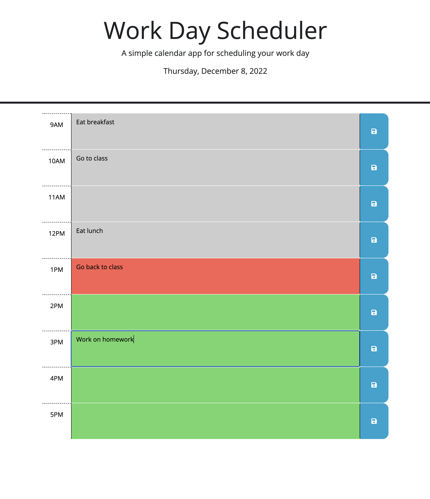

# Daily Calendar App

The Daily Calendar App is a web app that helps organize your work day. The app has hourly slots for the hours of 9 to 5, and users can save information in the slots allowing the app to remember it.

## Table of Contents

- [Description](#description)
- [Visuals](#visuals)
- [Support](#support)

## Description

The daily calendar app allows user to enter a reminder into each time slot, 9 to 5. If the save button is clicked, then the app will save the content on the text-enrty area into local storage, which will be retained on the page in case of refresh or if the page is revisited later. This way, the app can effectively serve as a reminder throughout your day.

## Visuals

## Support

If you encounter any issues with the daily calendar app, please reach out! My email is daniel.barto@gmail.com. Thank you!